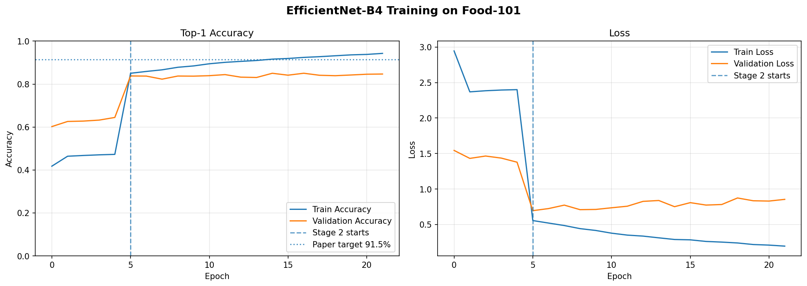
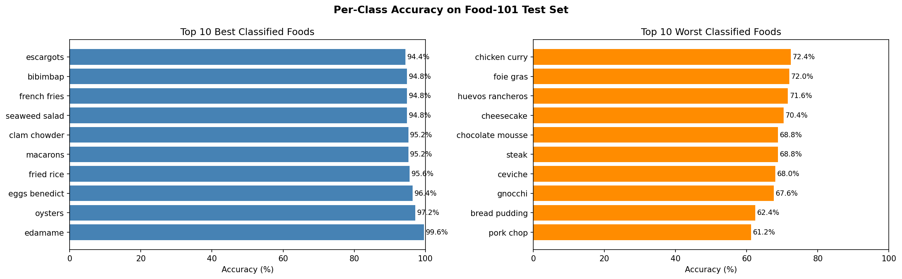

# EfficientNet: Transfer Learning on Food-101
CS 4782 Final Project — Akinwale Agesin — Cornell University

This repo is my attempt to re-implement the Food-101 transfer learning result from the EfficientNet paper (Tan & Le, ICML 2019). The paper proposes a smarter way to scale up neural networks by scaling depth, width, and resolution together instead of just one at a time.

---

## Chosen Result

I tried to replicate Table 5 from the paper — specifically EfficientNet-B4 fine-tuned on Food-101.

| Model | Top-1 Accuracy | # Params |
|---|---|---|
| Inception-v4 (paper) | 90.8% | 41M |
| EfficientNet-B4 (paper) | 91.5% | 19M |
| EfficientNet-B4 (mine) | 85.06% | 19M |

Didn't quite hit 91.5% but got to 85% which is still pretty good for 101 food classes.

---

## Repo Structure

```
├── code/         # the notebook
├── data/         # README with instructions to get Food-101
├── results/      # figures and results summary
├── poster/       # poster PDF
├── report/       # 2-page report PDF
├── .gitignore
└── LICENSE
```

---

## How I did it

- **Model:** EfficientNet-B4 pretrained on ImageNet via `keras.applications.EfficientNetB4`, swapped the head for a 101-class output layer
- **Dataset:** Food-101 loaded with `tensorflow_datasets`, resized to 380x380
- **Training:** 2-stage fine-tuning — first trained just the head (5 epochs), then unfroze everything and fine-tuned (25 epochs)
- **Platform:** Google Colab Pro (A100 GPU), took about 4 hours
- **Framework:** TensorFlow/Keras with mixed precision (float16)

---

## How to Run It

1. Open `code/efficientnet_food101.ipynb` in Google Colab
2. Set runtime to GPU (A100 if you can)
3. Run all cells top to bottom — Cell 4 will download Food-101 automatically
4. Results and plots get saved to Google Drive

You'll need a GPU with at least 16GB VRAM. Training takes 6-7 hours.

---

## Results




Got 85.06% top-1 and 95.98% top-5. The gap from the paper's 91.5% is mostly because the paper used TPUs, AutoAugment, and bigger batch sizes which are hard to replicate on Colab. Also had some overfitting in stage 2.

Best classes: edamame (99.6%), oysters (97.2%) — anything visually distinctive.
Worst classes: pork chop (61.2%), bread pudding (62.4%) — stuff that looks like other stuff.

---

## References

1. Tan & Le (2019). EfficientNet: Rethinking Model Scaling for CNNs. ICML 2019. https://arxiv.org/abs/1905.11946
2. Bossard et al. (2014). Food-101. ECCV 2014.
3. TensorFlow Datasets: https://www.tensorflow.org/datasets/catalog/food101

---

## Acknowledgements

Done as part of CS 4782 at Cornell (Spring 2025). Thanks to the course staff for the feedback throughout the semester.
